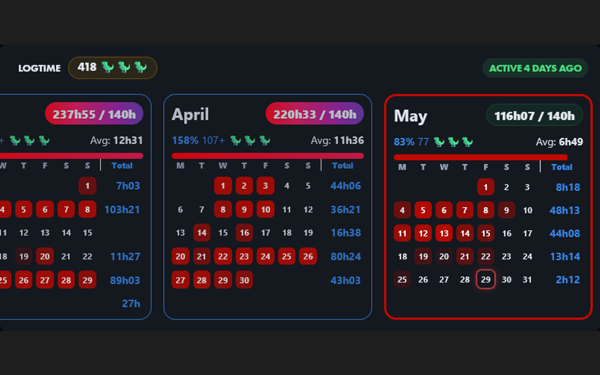
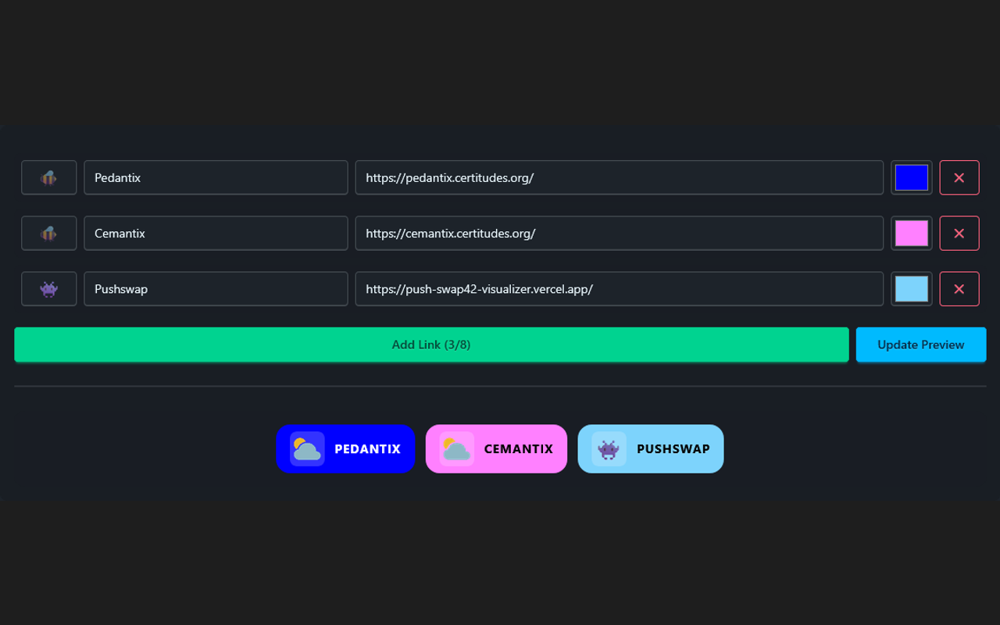

# Better Intra

UI and UX improvements for 42 Intra v3: logtime calendar, cluster map tools, custom profiles, shortcuts, friends widget, and more.

## ⚡ Quick Start

To install this extension, click the buttons below or visit the [Releases](https://github.com/nicopasla/better-intra/releases/latest/) page.

## Features

> ☁️ *marked features require cloud sync / 42 sign-in.*

### 📅 Logtime

Replaces the default logtime view with a monthly calendar showing your logged hours at a glance.

* **Monthly calendar** — each month shows your hours as a colour-coded grid. Darker means more hours per day. See weekly totals on the right.
* **Scroll through months** — click and drag, or use your mouse wheel.
* **Goal tracking** — set a target (default 140h/month). See a progress bar, your percentage, and remaining hours on hover.
* **Daily average** — average hours per active day.
* **Last active label** — shows when you were last seen. Choose between a date, "2 days ago", or both.
* **Emoji mode** — pick an emoji and set how much it's "worth". Track your earnings with a monthly cap.
* **Custom colours** — pick your own accent colour for the calendar and labels.
* **Calendar events overlay** — synced 42 events appear as markers on your logtime calendar days.

---

### 🖥️ Clusters

* **Directional markers** — small arrows on the cluster map showing which way each seat faces. Works for **Belgium** clusters (shi, fu, mi, a1, a2). Toggle on/off from the cluster tab bar.
* **Cluster picker** — a dropdown on the cluster tab bar to quickly switch clusters, with a markers on/off button.
* **Default cluster** — set your preferred cluster and it loads automatically when you open the page.
* **Open in new tab** — optionally open user profiles in a new tab when clicking seats on the cluster map.

---

### 🗺️ Cluster Map Dialog

A live interactive cluster map popup accessible from profile quick-link buttons.

* **Real-time seat occupancy** — see user avatars overlaid on occupied seats with login tooltips. Polls every 30 seconds with a "Updated X min ago" indicator.
* **Cluster room tabs** — switch between cluster rooms within the dialog.
* **Wi-Fi users list** — a dedicated tab showing who's currently connected via Wi-Fi, with avatars, logins, and connection time.
* **Click to visit profile** — click any occupied seat to open that user's profile, optionally in a new tab.
* **In-dialog settings** — toggle directional markers and set your default cluster from within the dialog.
* **Belgium-only** — full live map for Belgian campuses (campus ID 12). Other campuses get a direct link to the cluster map page.

---

### 👤 Profile

* **Custom visuals** — set your own avatar, banner, and background images with mode options (fill, fit, stretch, center, tile). **Click your avatar** on your profile page to open the customisation panel with zoom slider (50–200%), click-and-drag repositioning, and mouse wheel zoom on the preview. See a live preview as you type the image URL.
* **Avatar decoration** — toggle a transparent or solid-colour background behind your avatar with a colour picker. Add an optional solid border around your avatar.
* **Visuals sync** — your custom images are visible to other Better Intra users when they view your profile. Click any custom avatar to see the original one. ☁️
* **Instant profile visuals** — custom avatars, banners, and backgrounds are cached locally. After the first visit they appear instantly on any profile. Changes refresh silently in the background.
* **Dashboard cards** — reorder your profile cards (Logtime, Agenda, Evaluations, Projects, Achievements) by dragging them. Hide cards you don't need.
* **Project badges** — projects in the Projects card appear as colour-coded badges (green for normal projects, red for exams) for quick visual scanning.
* **Event filtering** — filter your agenda by campus and event type (exam, conference, workshop, hackathon, etc.).
* **Slots redirection** — automatically redirects slots and defense links for Belgium campus users when your campus is detected.
* **Sort evaluation slots** — pending evaluations split into "Evaluator" and "Evaluated" sections for easier browsing.
* **Achievement milestones** — completed achievements get a subtle animated glow.
* **Full achievements list** — replaces the native "Last Achievements" card with a scrollable list of all achievements.
* **Completed projects (marks)** — the Projects card lists all your graded projects with dates and scores. Multi-attempt projects expand to show each attempt. Sort by newest or oldest first. Projects flagged "Outstanding" during evaluation get a ⭐ next to their name — visible on any user's profile. ☁️
* **Projects sort** — sort the projects list on any user's profile by name or date, with toggleable ascending/descending order.
* **Freeze alerts** — a freeze card appears on profiles of frozen students.
* **Clickable seat label** — click someone's seat on their profile to open the cluster map with their seat highlighted and pulsating.
* **Thursday Roulette** — a dashboard card showing the current profile's roulette win history, total points, and a live countdown to the next Thursday 8:00 draw. Works on any user's profile. ☁️
* **Evaluation stats** — the Thursday Roulette card also shows your monthly evaluation history as a corrector: total evaluations, failures, and success percentage. ☁️
* **Moulinette robot icons** — on project corrected pages, the default moulinette image is replaced with a robot icon (normal for passed, broken for failed).
* **Info card badges** — wallet, level, rank, score, and seat shown as coloured badges below the profile header. Can be hidden in settings.
* **Wallet shop link** — clicking the wallet badge opens the 42 shop in a new tab.

---

### 🏫 Campus Detection

Your 42 campus is detected automatically — no manual setup.

* **Passive detection** — visiting your profile page silently detects your campus from the intra's own API. Your detected campus appears as a badge in the Advanced settings tab.
* **Seat direction markers** — cluster screen arrows load automatically for your detected campus. Available for all campuses with submitted cluster data.
* **Contributing** — add your campus by submitting cluster name/ID data via a pull request to the [campuses/](https://github.com/nicopasla/better-intra/tree/main/campuses) directory.

---

### 🔗 Shortcuts

Quick-access links shown as colourful buttons on your profile page.

* Up to **8 links**, each with a name, URL, custom colour, and optional emoji.
* Buttons show the site's icon automatically if you don't set an emoji.
* Text colour (black or white) is chosen automatically for readability.
* **Drag to reorder** — drag the preview buttons in the settings panel to rearrange your links.
* **Hide important links** — optionally hide the default Intra navigation links to give shortcuts the full width.
* **Alignment** — when important links are hidden, align your shortcuts left, center, or right.
* Set them up in the settings panel.

---

### 📅 Calendar Sync ☁️

Subscribe to your 42 events in any calendar app with a private ICS subscription URL.

* **ICS subscription** — generate a private ICS URL compatible with Google Calendar, Apple Calendar, Outlook, and more.
* **QR code** — scan the code in the Calendar tab for easy mobile setup.
* **Auto-sync** — events refresh automatically on each profile visit.
* Configure from the **Calendar** tab in the Settings Hub.

---

### 🔔 Evaluations ☁️

Discord DM notifications when your evaluations change state.

* **Discord DMs** — receive alerts in your DMs via the Better Intra bot when an evaluation is booked or when correcteds are revealed. Connect your Discord account from the Discord hub tab — auto-joins **Le Bassin** server to enable direct messages.
* **Quiet hours** — pause Discord notifications during specified hours (e.g. 22:00 to 08:00) so you're not disturbed at night.
* **State tracking** — automatically alerts you via Discord DM when an evaluation is booked or when correcteds are revealed.
* Configure from the **Discord** tab in the Settings Hub.

---

### 🎨 Theme

* **Dark / Light** — swap between modes from the hub footer using the sun/moon toggle button.
* **30+ theme presets** — pick from light themes (garden, cupcake, retro, emerald, etc.) and dark themes (synthwave, dracula, cyberpunk, forest, neon, soap, citrus, and more). Recolours profile badges, sidebar, progress bars, and accents across the intra.

---

### ☁️ Account (Cloud Sync)

* Authenticate with your 42 Intra account via OAuth through the Cloudflare Worker.
* **Push** — upload all local settings to the cloud.
* **Pull** — download and apply settings from the cloud to this device.
* **Auto-push** — toggle in the hub footer. When enabled, clicking Reload sends all settings to the cloud before refreshing the page.

* **Disconnect / Wipe All Data** — logout or erase all cloud-stored data.
* **Share visuals** — synced avatar, banner, and background become visible to other Better Intra users viewing your profile.
* Account panel is in the **extension popup** (click the extension icon).

---

### 👥 Friends ☁️

A friends panel accessible from a button in the bottom-right corner of the page.

* **Add friends** by login using the input at the bottom of the panel.
* See each friend's **avatar, level bar, wallet, correction points, and online status**.
* **Profile friend button** — a button appears next to the role dropdown on any user's profile, letting you follow or unfollow without opening the full widget.
* Click a friend's **location badge** to open the cluster map with their seat highlighted.
* Sort by: online status, name, level, wallet, or evaluation points.
* **Medal borders** — the top 3 friends (by chosen sort order) get gold, silver, and bronze borders.
* The button shows a badge with the **number of friends currently online**.
* Data refreshes every 30 seconds; tap the refresh button to force an update.

---

### ⚙️ Settings Hub

* All extension settings in one place.
* Click the **gear icon** on the intra sidebar to open it.
* Tabs: Logtime, Clusters, Profile, Shortcuts, Discord, Calendar, Advanced, About.
* Turn features on/off individually, or reset a feature's settings to default.
* The footer bar shows your theme toggle, cloud connection status, last sync badge, and auto-push toggle.
* **Backup & Restore** — export all settings to a timestamped JSON file, or import from a previous backup. In the Advanced tab.
* **Reset all data** — wipe all Better Intra settings and start fresh. In the Advanced tab.
* **Auto-detected campus** — shown as a badge in the Advanced tab.
* **Open links in new tab** — external links from Better Intra open in a new tab. In the Advanced tab.

## Support

> Donations help cover the cost of the **Cloudflare Workers Pro** plan ($5/month) and the **domain name**, which power the cloud sync backend, evaluation notifications, and friends feature,...

## Screenshots

| Logtime                                   | Profile                              | Shortcuts                                         |
|-------------------------------------------|--------------------------------------|---------------------------------------------------|
|  |  |  |

## Uninstall

Go to `about:addons` in Firefox, find **Better Intra** and click **Remove**.

## Disclaimer

This is a personal project. It modifies the appearance of 42 Intra and adds UI improvements (logtime tracking, shortcuts, etc.). It can break at any time due to intra code changes. Use at your own risk.

## Built with:

* TypeScript (Core logic)
* [Vite](https://vite.dev/) (Bundler & asset pipeline)
* [DaisyUI](https://daisyui.com/) & **Tailwind CSS** (UI components & settings modal)
* GitHub Actions (CI/CD for automated builds, versioning, and changelogs)
* Gemini and Copilot Student (Documentation & Optimization)
* Cloudflare Workers, KV & D1 (Serverless backend for cloud sync, eval tracking & notifications)
* [`better-intra-worker/`](./better-intra-worker/) — separate Cloudflare Worker handling cloud sync, evaluation state tracking, project map, and Discord bot
* 42 API (OAuth2) (Secure user identification and authentication)
* Discord API (Bot for evaluation notifications)
* [OpenCode](https://opencode.ai) + DeepSeek V4 Pro (AI coding agent)
* [Font Awesome](https://fontawesome.com/icons) & [Lucide](https://lucide.dev/) (SVG icons)
* 42 logo from [Wikimedia Commons](https://commons.wikimedia.org/wiki/File:42_Logo.svg)
* Robot icons from Wikimedia Commons ([normal](https://commons.wikimedia.org/wiki/File:Robot_icon.svg) and [broken](https://commons.wikimedia.org/wiki/File:Robot_icon_broken.svg))
* Intra v2 dark mode from [Improved Intra](https://github.com/FreekBes/improved_intra/tree/main/features/themes)

## Compatibility

| Browser | Support |    Note     |
|:-------:|:-------:|:-----------:|
| Firefox |    ✅    | Main target |
| Chrome  |    ✅    |  Supported  |
|  Brave  |    ✅    |  Supported  |

## Privacy

See the full [Privacy Policy](./PRIVACY.md).

- All settings are stored locally via `chrome.storage.local`. Nothing is sent anywhere unless you explicitly enable cloud sync.
- **Cloud sync** (optional): your settings are stored in a Cloudflare Worker KV under a hash of your login, so they can be synced across devices. The worker retains invocation logs for debugging (not used for tracking).
- **Friends widget** (optional, requires cloud sync): friend logins are stored locally and also included in your synced settings in KV. The worker additionally caches friend user IDs and online status in KV to reduce 42 API calls.
- **Logtime data** is read from the intra page directly — it never leaves your browser.
- **Other users' profiles**: when visiting another user's profile, their public custom visuals (avatar, banner, background) are fetched from the Cloudflare Worker if they use Better Intra. No data is sent to third parties.
- Permissions requested: `storage` (save settings), `activeTab` (interact with 42 Intra pages), and access to the extension's Cloudflare Worker for optional sync features. No analytics, tracking, or advertising.

## Development

See [DEVELOPMENT.md](./DEVELOPMENT.md).

## License

[MIT](./LICENSE)
