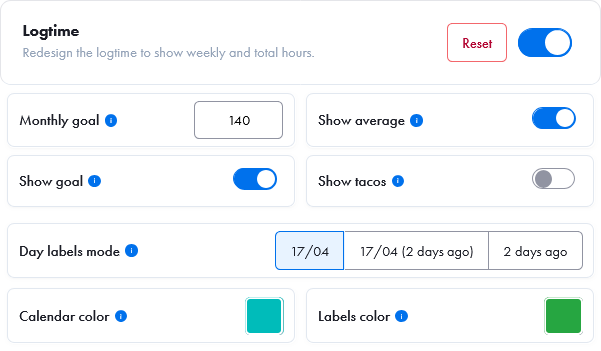
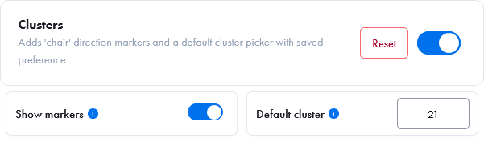
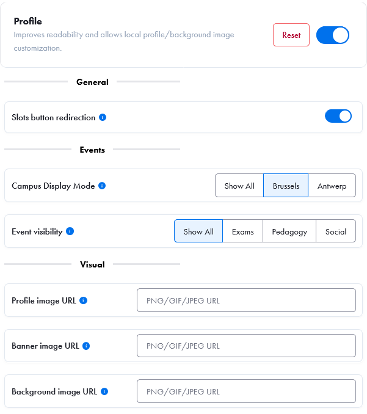

# 42 Userscripts

Collection of features inside a single Userscript that improve UI and UX of the 42 Intra v3.

## Quick Install

Install [Violentmonkey](https://violentmonkey.github.io/) and [install](https://github.com/nicopasla/42-userscripts/releases/latest/download/better-intra.user.js) the script from the releases pages.

## Features

### Logtime

Replaces the default logtime calendar with a more practical and accessible view using the same data.

### Clusters

Adds a rectangle to mimic a chair for the direction of the person and a default cluster picker with saved preference.

### Profile

Improves readability, allows local profile/background image customization, add a new button to sort events.

## Installation

1. Install [Violentmonkey](https://violentmonkey.github.io/) or [Tampermonkey](https://www.tampermonkey.net/) for your browser.
2. Open any userscript in the [Userscripts](#userscripts) section by clicking the file name.
3. Your userscript manager will prompt you to install it.

## Uninstall

Disable or remove the script from your userscript manager.

## Disclaimer

This extension is a personal project that only changes the style of the website. It is purely aesthetic and does not fetch anything.
These scripts can break at any time due to intra code changes.
Always use at your own risk!

## Compatibility

Tested only on Firefox (Old and new)

| Browser | Tampermonkey | Violentmonkey |
| :-----: | :----------: | :-----------: |
| Firefox |      ✅      |      ✅       |
| Chrome  |      ❓      |      ❓       |
|  Brave  |      ❓      |      ❓       |

## Privacy

- This script is only working on local.
- Settings are stored locally (userscript storage).

## Changelog

### [logtime.user.js](#logtimeuserjs)

#### [0.2.0] - 2026-04-16

- Added options to format the "last active" date
- Removed scrollbars to make the panel draggable
- Changed "Last connected" to "Active"
- Changed place where the calendar inject itself
- Cleaned the code

#### [0.1.1] - 2026-04-16

- Added close button to the settings menu
- Added tacos

#### [0.1.0] - 2026-04-14

- Added settings panel to show/hide labels, change colors, and change goal hour
- Added local storage for settings
- Added "last connected" label

#### [0.0.4] - 2026-03-13

- Fixed percentage not going over 100%

#### [0.0.3] - 2026-03-13

- Added tooltip to show remaining hours when clicking percentage

#### [0.0.2] - 2026-03-13

- Removed target and added percentage

#### [0.0.1] - 2026-03-13

- Initial version

### [clusters.user.js](#clustersuserjs)

#### [0.0.1] - 2026-04-18

- Initial version

### [profile.user.js](#profileuserjs)

#### [0.0.2] - 2026-04-18

- Increased text size and improved font readability on other profiles
- Switched from `localStorage` to userscript storage (GM APIs)

#### [0.0.1] - 2026-04-16

- Added ability to change profile and background images
- Added settings and storage for image links
- Increased text size and improved font readability

### [youtube.user.js](#youtubeuserjs)

#### [0.0.2] - 2026-04-17

- Switched from `localStorage` to userscript storage (GM APIs)

#### [0.0.1] - 2026-04-14

- Initial version

### [shortcuts.user.js](#shortcutsuserjs)

#### [0.0.1] - 2026-04-17

- Initial version with 8 shortcuts to customize

## TODO

- At some point it should be converted into a single Firefox extension, for now it's easier to maintain a single Userscript to fix specific bugs

## License

MIT
