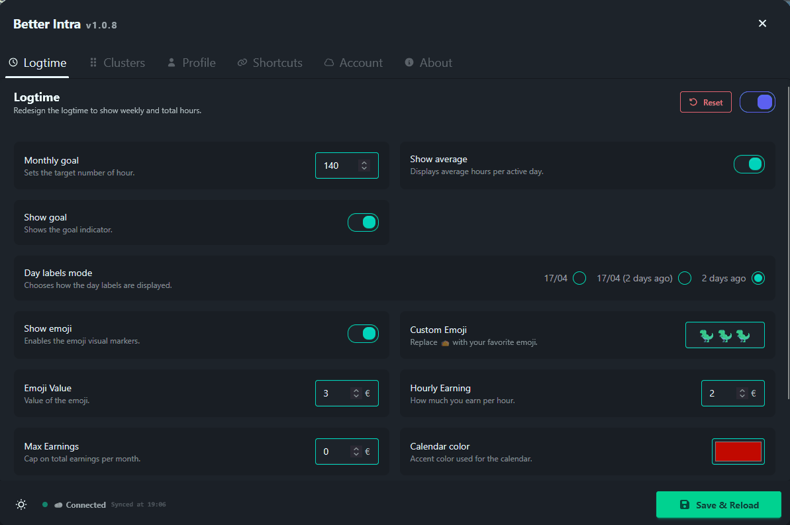
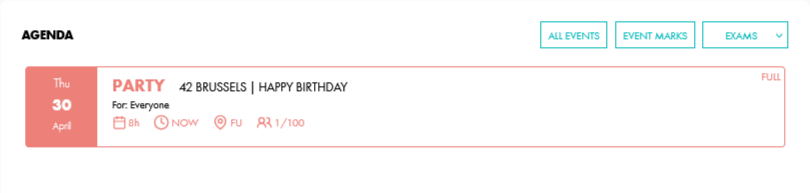
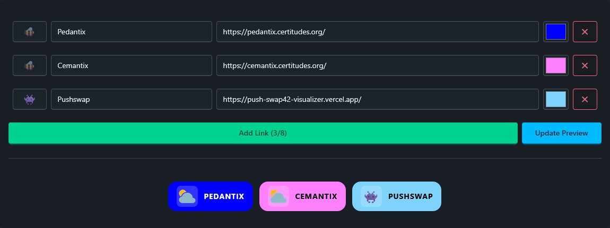
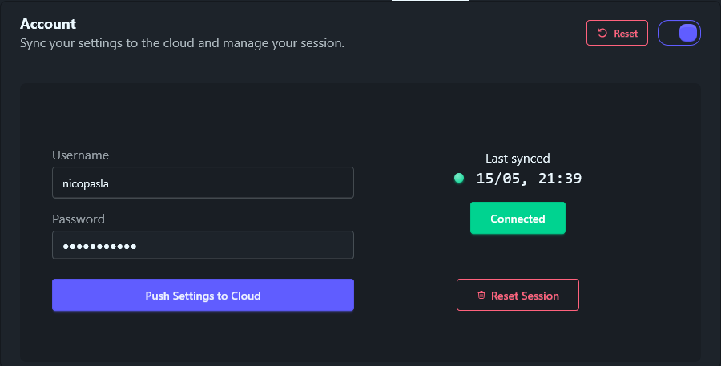

# Better Intra

Collection of features inside a single Userscript that improve UI and UX of the 42 Intra v3.

## ⚡ Quick Start

1.  **Install a Manager:** **[Violentmonkey](https://violentmonkey.github.io/)** (recommended) or [Tampermonkey](https://www.tampermonkey.net/).
2.  **Install the Script:** **[Click here to install](https://github.com/nicopasla/better-intra/releases/latest/download/better-intra.user.js)**.
3.  Refresh your Intra tab and explore the new features.

## Features

### 📅 Logtime

Redesigns logtime tracking to show weekly and total hours.

* **Goal Tracking:** Set a target number of hours (default: 140) to track your progress.
* **Daily Average:** Display your average hours per day.
* **Last active label:** Date can be displayed as "17/04", "2 days ago", or both.
* **Visual Control:** Fully customize calendar and label colors to match your taste.
* **Emoji visualizer:** custom emoji, emoji value and hourly earning.

---

### 🖥️ Clusters

Improves cluster navigation and visual orientation.

* **Directional Markers:** Adds "chair" icons to the cluster map to show seat orientation.
* **Default Cluster:** Set a preferred Cluster ID to load your favorite cluster instantly.

---

### 👤 Profile

Enhances readability and adds local customization options.

* **Change your:**
  * Avatar
  * Banner
  * Background

> When viewing another person profile with Better Intra installed you will see his custom images.

* **Event Filtering:**
  * Campus Filter.
  * Category Filter.
* Redirection of the "Manage slots" button to the correct webpage.
* Improved readability using a clean system-font stack.

---

### 🔗 Shortcuts

Adds custom quick-access links on the profile page.

* Up to 8 configurable shortcuts

### ☁️ Account

* Store your local settings into a KV database on a Cloudflare Worker.

---

### ⚙️ Settings


## Screenshots






## Uninstall

Disable or remove the script from your userscript manager.

## Disclaimer

This extension is a personal project that only changes the style of the website. It is purely aesthetic and does not fetch anything except esthetics settings when visiting others profiles.
This can break at any time due to intra code changes.
Always use at your own risk!

## Built with:

* Typescript / JavaScript (Core Logic)
* [DaisyUI](https://daisyui.com/) (Modal settings dialog, documentation)
* GitHub Actions to create the changelog and the build when there a new release.
* Gemini and Copilot Student (Documentation & Optimization)
* Cloudflare Worker KW for the backend to store settings.
* SVG icons are from [Font Awesome](https://fontawesome.com/)

## Compatibility

Tested only on Firefox (Old and new), only work on Intra v3

| Browser | Tampermonkey | Violentmonkey |
| :-----: | :----------: | :-----------: |
| Firefox |      ✅      |      ✅       |
| Chrome  |      ❓      |      ❓       |
|  Brave  |      ❓      |      ❓       |

## Privacy

- This script is only working on local. (Except when sending and receiving settings into a Cloudflare Worker)
- Settings are stored locally (userscript storage) or if you choose to inside a Cloudflare Worker KV.
- The release is created using Github Actions from the source.

## Development

### Prerequisites

- Node.js
- npm

### Setup

```bash
git clone https://github.com/nicopasla/better-intra.git
cd better-intra
npm install
```
* **Development build**
```bash
npm run dev
```
* **Production build**
```bash
npm run build
npm run preview
```
The output better-intra.user.js file will be generated in the dist folder.

## TODO

- At some point it should be converted into a single Firefox extension, for now it's easier to maintain a single Userscript to fix specific bugs

## License

MIT
