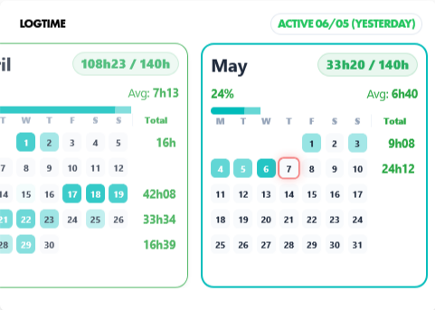
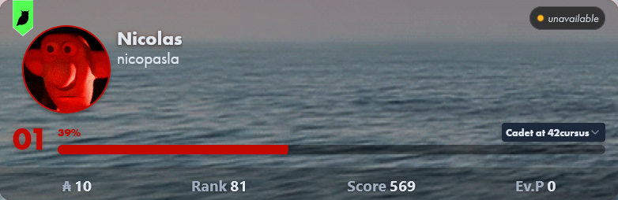
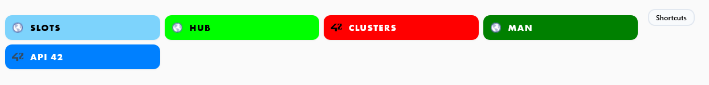
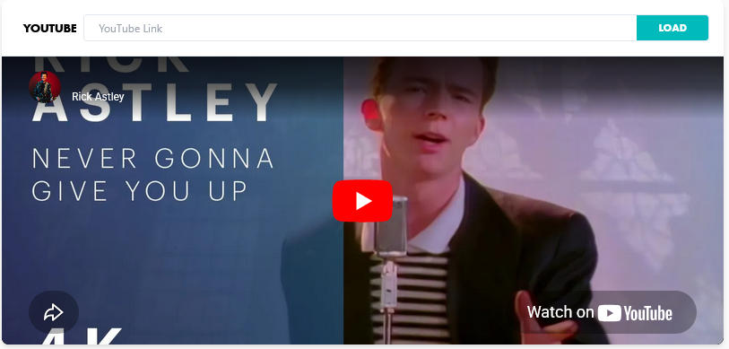

# 42 Userscripts

Collection of Userscripts to improve UI and UX of the 42 Intra v3.

At some point all of these Userscripts will be added to a single Firefox
extension, for now it's easier to maintain small Userscripts to fix specific bugs

## Userscripts

### [logtime.user.js](https://raw.githubusercontent.com/nicopasla/42-userscripts/main/logtime.user.js)

Replaces the default logtime calendar with a more practical and accessible view using the same data.

- Shows weekly and total hours
- Average is calculated on active days
- Data comes from `locations_stats` loaded with the profile
- Last connection status is derived from `locations_stats`
- Settings are stored in local storage

### [clusters.user.js](https://raw.githubusercontent.com/nicopasla/42-userscripts/main/clusters.user.js)

Adds iMac direction markers and a default cluster picker with saved preference.

- Select a default cluster to auto-open on the clusters page
- Toggle iMac direction markers on/off

### [profile.user.js](https://raw.githubusercontent.com/nicopasla/42-userscripts/main/profile.user.js)

Improves readability and allows local profile/background image customization.

- Bigger and more readable text
- Change profile/background images by clicking your profile picture (local only)
- Image settings are stored in local storage

### [shortcuts.user.js](https://raw.githubusercontent.com/nicopasla/42-userscripts/main/shortcuts.user.js)

Add up to 8 shortcuts next to the announcements

- Add up to 8 shortcuts to your Intra

### [youtube.user.js](https://raw.githubusercontent.com/nicopasla/42-userscripts/main/youtube.user.js)

Totally useless Youtube player inside Intra v3

- Last played video is saved
- Could be reused later for notes/stats/widgets

## Quick Install

Click any script link in the [Userscripts](#userscripts) section, then confirm install in Tampermonkey/Violentmonkey.

## Installation

1. Install [Tampermonkey](https://www.tampermonkey.net/) or [Violentmonkey](https://violentmonkey.github.io/) for your browser.
2. Open any userscript in the [Userscripts](#userscripts) section by clicking the file name.
3. Your userscript manager will prompt you to install it.

## Uninstall

Disable or remove scripts from your userscript manager.

## Disclaimer

This extension is a personal project that only changes the style of the website. It is purely aesthetic and does not fetch anything.
These scripts can break at any time due to intra code changes.
Always use at your own risk!

## Compatibility

Tested only on Firefox (Old and new)

| Browser | Tampermonkey | Violentmonkey |
| ------- | ------------ | ------------- |
| Firefox | ✅           | ✅            |

## Privacy

- These scripts are only working on local.
- Settings are stored locally (local storage / userscript storage).

## Changelog

### [logtime.user.js](#logtimeuserjs)

#### [0.2.0] - 2026-04-16

- Added options to format the "last active" date
- Removed scrollbars to make the panel draggable
- Changed "Last connected" to "Active"
- Changed place where the calendar inject itself
- Cleaned the code

#### [0.1.1] - 2026-04-16

- Added close button to the settings menu
- Added tacos

#### [0.1.0] - 2026-04-14

- Added settings panel to show/hide labels, change colors, and change goal hour
- Added local storage for settings
- Added "last connected" label

#### [0.0.4] - 2026-03-13

- Fixed percentage not going over 100%

#### [0.0.3] - 2026-03-13

- Added tooltip to show remaining hours when clicking percentage

#### [0.0.2] - 2026-03-13

- Removed target and added percentage

#### [0.0.1] - 2026-03-13

- Initial version

### [clusters.user.js](#clustersuserjs)

#### [0.0.1] - 2026-04-18

- Initial version

### [profile.user.js](#profileuserjs)

#### [0.0.2] - 2026-04-18

- Increased text size and improved font readability on other profiles
- Switched from `localStorage` to userscript storage (GM APIs)

#### [0.0.1] - 2026-04-16

- Added ability to change profile and background images
- Added settings and storage for image links
- Increased text size and improved font readability

### [youtube.user.js](#youtubeuserjs)

#### [0.0.2] - 2026-04-17

- Switched from `localStorage` to userscript storage (GM APIs)

#### [0.0.1] - 2026-04-14

- Initial version

### [shortcuts.user.js](#shortcutsuserjs)

#### [0.0.1] - 2026-04-17

- Initial version with 8 shortcuts to customize

## License

MIT
