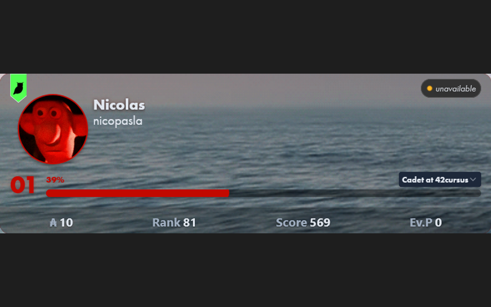

# Better Intra

UI and UX improvements for 42 Intra v3: logtime calendar, cluster map tools, custom profiles, shortcuts, friends widget, and more.

## Screenshots

| Logtime | Profile | Shortcuts |
|---|---|---|
|  |  |  |

## ⚡ Quick Start

To install this extension, click the buttons below or visit the [Releases](https://github.com/nicopasla/better-intra/releases/latest/) page.

## Features

### 📅 Logtime

Replaces the default logtime view with a monthly calendar showing your logged hours at a glance.

* **Monthly calendar** — each month shows your hours as a colour-coded grid. Darker means more hours per day. See weekly totals on the right.
* **Scroll through months** — click and drag, or use your mouse wheel.
* **Goal tracking** — set a target (default 140h/month). See a progress bar, your percentage, and remaining hours on hover.
* **Daily average** — average hours per active day.
* **Last active label** — shows when you were last seen. Choose between a date, "2 days ago", or both.
* **Emoji mode** — pick an emoji and set how much it's "worth". Track your earnings with a monthly cap.
* **Custom colours** — pick your own accent colour for the calendar and labels.
* **Animations** — smooth progress bar animation; can be turned off.

---

### 🖥️ Clusters

* **Directional markers** — small arrows on the cluster map showing which way each seat faces. Works for **Belgium** clusters (shi, fu, mi, a1, a2). Toggle on/off from the cluster tab bar.
* **Cluster picker** — a dropdown on the cluster tab bar to quickly switch clusters, with a markers on/off button.
* **Default cluster** — set your preferred cluster and it loads automatically when you open the page.

---

### 👤 Profile

* **Custom visuals** — set your own avatar, banner, and background images. **Click your avatar** on your profile page to open the customisation panel. See a live preview as you type the image URL.
* **Visuals sync** — your custom images are visible to other Better Intra users when they view your profile. Click any custom avatar to see the original one. ☁️
* **Instant profile visuals** — custom avatars, banners, and backgrounds are cached locally. After the first visit they appear instantly on any profile. Changes refresh silently in the background.
* **Dashboard cards** — reorder your profile cards (Logtime, Agenda, Evaluations, Projects, Achievements) by dragging them. Hide cards you don't need.
* **Profile card** — animated level bar with a wave effect, coloured to match your preference.
* **Event filtering** — filter your agenda by campus and event type (e.g. exams, pedagogy, social).
* **Slots redirection** — the "Manage slots" button takes you to the correct slots page.
* **Achievement milestones** — completed achievements get a subtle animated glow.
* **Completed projects (marks)** — the Projects card lists all your graded projects with dates and scores. Multi-attempt projects expand to show each attempt. Sort by newest or oldest first.
* **Freeze alerts** — a freeze card appears on profiles of frozen students.
* **Clickable seat label** — click someone's seat on their profile to open the cluster map with their seat highlighted and pulsating.

---

### 🔗 Shortcuts

Quick-access links shown as colourful buttons on your profile page.

* Up to **8 links**, each with a name, URL, custom colour, and optional emoji.
* Buttons show the site's icon automatically if you don't set an emoji.
* Text colour (black or white) is chosen automatically for readability.
* **Drag to reorder** — drag the preview buttons in the settings panel to rearrange your links.
* **Hide important links** — optionally hide the default Intra navigation links to give shortcuts the full width.
* Set them up in the settings panel.

---

### 🔔 Evaluations ☁️

Desktop notifications when your evaluations change state.

* **State tracking** — notifies you when an evaluation is booked, revealed, or about to start.
* **Background service** — checks for updates even when no intra pages are open.
* **15‑minute reminder** — get a notification 15 minutes before slot reveals.
* **Discord DMs** (optional) — receive notifications in your Discord DMs through the Better Intra bot.
* Configure from the Evaluations tab in the Settings Hub.

---

### 🎨 Theme

* **Dark / Light / System** — choose your preferred theme for the extension UI. Follows your system setting automatically when set to "System".
* Set from the Settings Hub or the extension popup.

---

### ☁️ Account (Cloud Sync)

* Authenticate with your 42 Intra account via OAuth through the Cloudflare Worker.
* **Push** — upload all local settings to the cloud.
* **Pull** — download and apply settings from the cloud to this device.
* **Auto-sync** — toggle automatic cloud sync on save.
* **Disconnect / Wipe All Data** — logout or erase all cloud-stored data.
* **Share visuals** — synced avatar, banner, and background become visible to other Better Intra users viewing your profile.
* Account panel is in the **extension popup** (click the extension icon).

---

### 👥 Friends ☁️

A friends panel accessible from a button in the bottom-right corner of the page.

* **Add friends** by login using the input at the bottom of the panel.
* See each friend's **avatar, level bar, wallet, correction points, and online status**.
* Click a friend's **location badge** to open the cluster map with their seat highlighted.
* Sort by: online status, name, level, wallet, or evaluation points.
* **Medal borders** — the top 3 friends (by chosen sort order) get gold, silver, and bronze borders.
* The button shows a badge with the **number of friends currently online**.
* Data refreshes every 30 seconds; tap the refresh button to force an update.

---

### ⚙️ Settings Hub

* All extension settings in one place.
* Click the **gear icon** on the intra sidebar to open it.
* Tabs: Logtime, Clusters, Profile, Shortcuts, Evaluations, About.
* Turn features on/off individually, or reset a feature's settings to default.

## Uninstall

Go to `about:addons` in Firefox, find **Better Intra** and click **Remove**.

## Disclaimer

This is a personal project. It modifies the appearance of 42 Intra and adds UI improvements (logtime tracking, shortcuts, etc.). It can break at any time due to intra code changes. Use at your own risk.

## Built with:

* TypeScript (Core logic)
* [Vite](https://vite.dev/) (Bundler & asset pipeline)
* [DaisyUI](https://daisyui.com/) & **Tailwind CSS** (UI components & settings modal)
* GitHub Actions (CI/CD for automated builds, versioning, and changelogs)
* Gemini and Copilot Student (Documentation & Optimization)
* Cloudflare Workers & KV (Serverless backend for cloud settings storage)
* 42 API (OAuth2) (Secure user identification and authentication)
* Font Awesome (SVG icons)
* Intra v2 dark mode from [Improved Intra](https://github.com/FreekBes/improved_intra/tree/main/features/themes)

## Compatibility

| Browser | Support |           Note            |
|:-------:|:-------:|:-------------------------:|
| Firefox |    ✅    | Main target |
| Chrome  |    ✅    | Supported   |
|  Brave  |    ✅    | Supported   |

## Privacy

See the full [Privacy Policy](./PRIVACY.md).

- All settings are stored locally via `chrome.storage.local`. Nothing is sent anywhere unless you explicitly enable cloud sync.
- **Cloud sync** (optional): your settings are stored in a Cloudflare Worker KV under a hash of your login, so they can be synced across devices. The worker retains invocation logs for debugging (not used for tracking).
- **Friends widget** (optional, requires cloud sync): friend logins are stored locally and also included in your synced settings in KV. The worker additionally caches friend user IDs and online status in KV to reduce 42 API calls.
- **Logtime data** is read from the intra page directly — it never leaves your browser.
- **Other users' profiles**: when visiting another user's profile, their public custom visuals (avatar, banner, background) are fetched from the Cloudflare Worker if they use Better Intra. No data is sent to third parties.
- Permissions requested: `storage` (save settings), `activeTab` (interact with the intra page), and access to the extension's Cloudflare Worker for optional sync features. No analytics, tracking, or advertising.

## Development

See [DEVELOPMENT.md](./DEVELOPMENT.md).

## License

MIT

